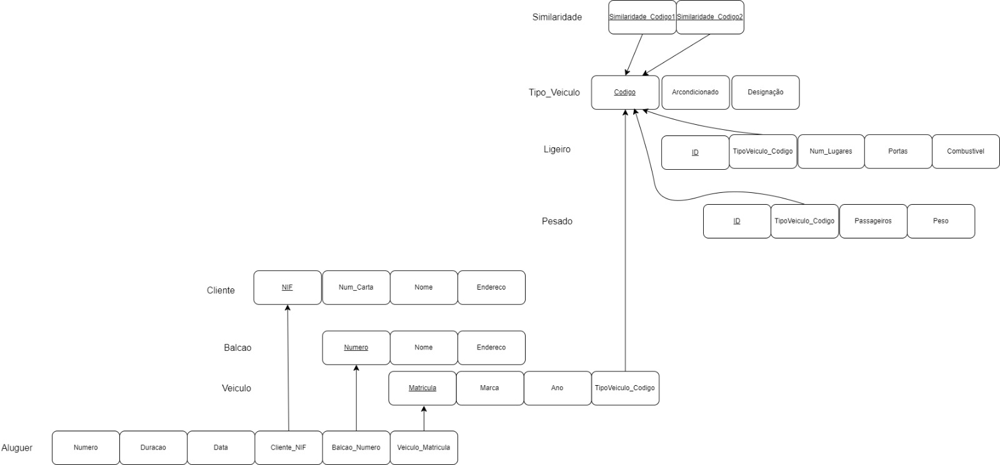
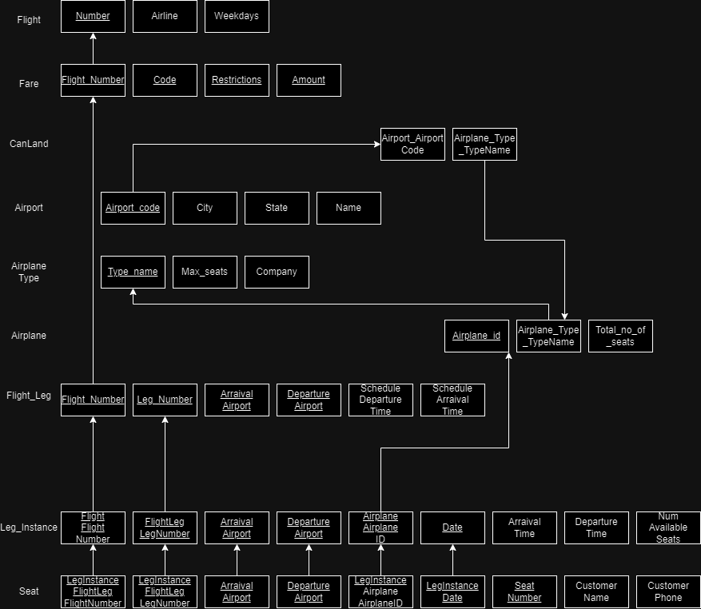
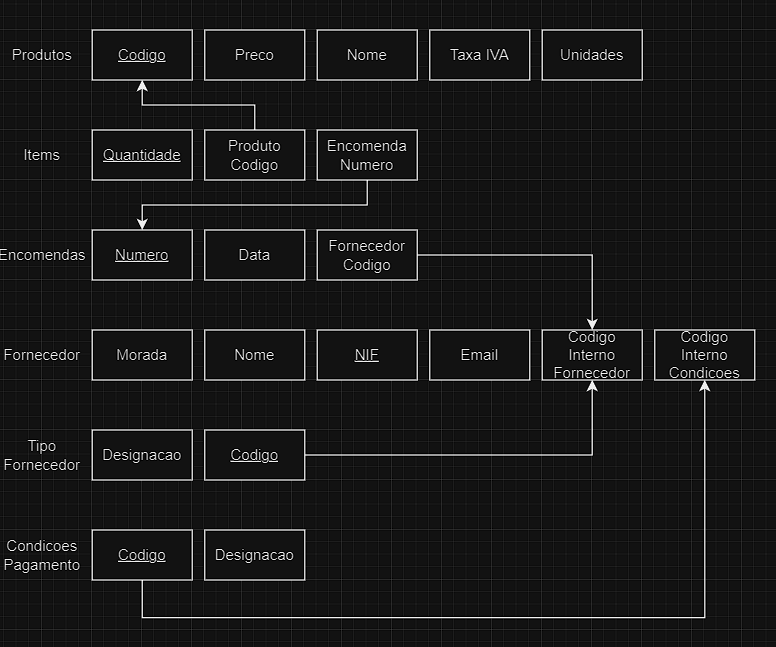
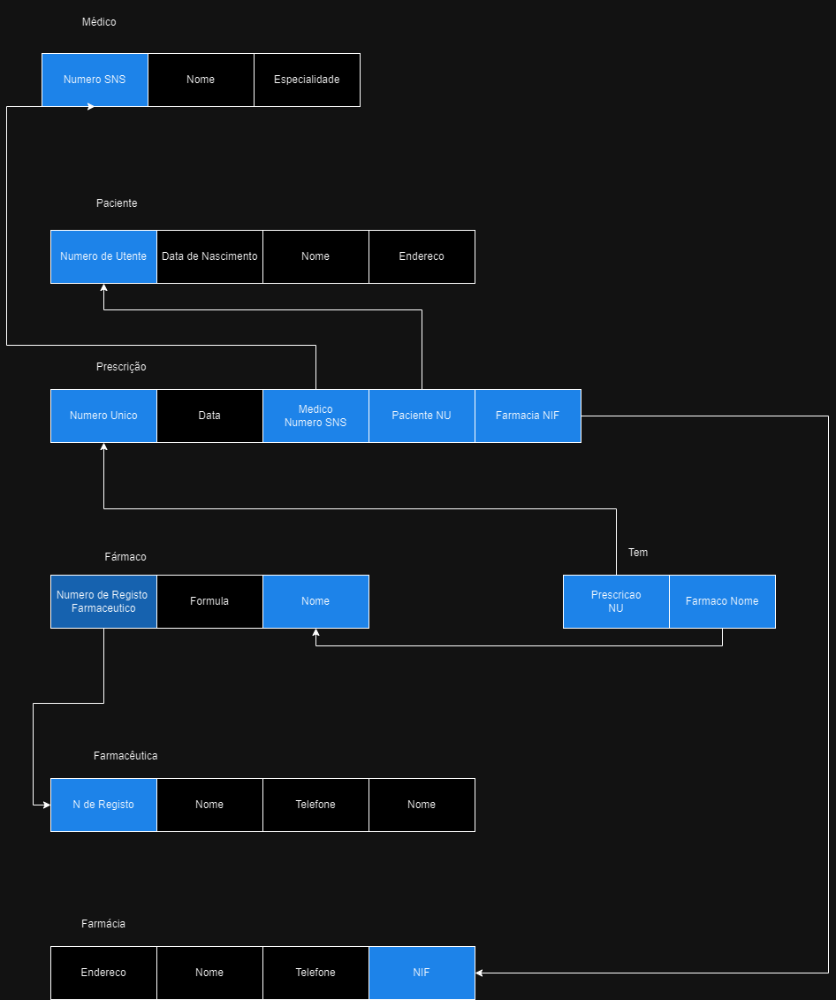
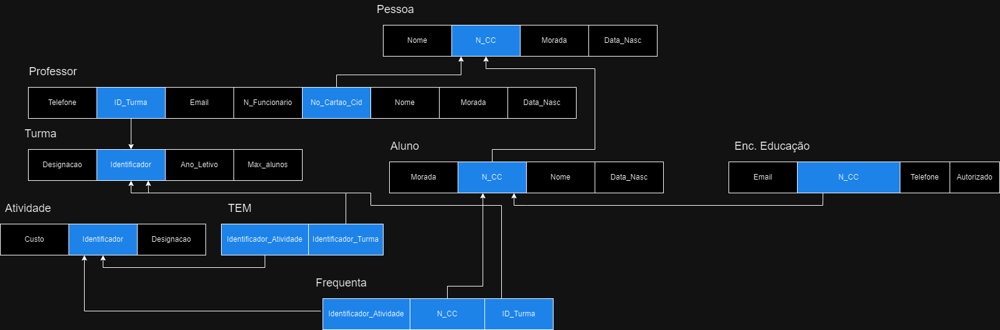

# BD: Guião 3


## ​Problema 3.1
 
### *a)*

```

ENTIDADE - Cliente - Nif,Nome,Endereço,Num.Carta,
ENTIDADE - Balcão - Nome,Endereço,Numero
ENTIDADE - Veiculo - Matricula,ano,marca,TipoVeiculo_código(pontinhos)
ENTIDADE - Aluguer - Data,Duração,Numero,cliente_nif(pontinhos),balcao_numero(pontinhos),veiculo_matricula(pontinhos)
ENTIDADE - Tipo_Veiculo - código,arcondicionado,designação
Similaridade:TVcondição(pontinhos),Tvcondição(pontinhos)
Ligeiro:TipoVeiculo_Codigo(pontinhos),Combustivel,portas,numlugares
Pesado:TipoVeiculo_Codigo(pontinhos),peso,passageiros

```

### *b)* 

```
Cliente: 
		Chave primária -> NIF
		Chave candidatas -> NIF,NumCarta
		Chave estrangeiras -> --
Balcao: 
		Chave primária -> Numero
		Chave candidatas -> Numero
		Chave estrangeiras -> --
Veiculo: 
		Chave primária -> Matricula
		Chave candidata -> Matricula
		Chave estrangeiras -> TipoVeiculo_Codigo
Aluguer: 
		Chave primária -> Numero
		Chave candidatas -> Numero,(Veiculo_Matricula + Balcao_Numero+ Cliente_NIF + Data)
		Chave estrangeiras -> Veiculo_Matricula, Balcao_Numero, Cliente_NIF
Similaridade: 
		Chave primária -> TipoVeiculo_Codigo1 + TipoVeiculo_Codigo2
		Chave candidatas -> TipoVeiculo_Codigo1 + TipoVeiculo_Codigo2
		Chave estrangeiras -> TipoVeiculo_Codigo, Tipo_Veiculo_Codigo


```


### *c)* 




## ​Problema 3.2

### *a)*

```
Flight: number,airline,weekday
Flight_Leg:Flight_number,Leg_num,airport_dep,airport_arr (tudo com sublinhado)
Leg_instance:Flight_number,Leg_num,airport_dep,airport_arr (tudo com sublinhado),airplane+airplaneid+date(pontinhos),num_avaiable_seats
Seat:Flight_number,Leg_num,airport_dep,airport_arr (tudo com sublinhado),airplane+airplaneid+date(pontinhos),num_avaiable_seats,costumer_name,phone,seat_no(pontinhos)
```


### *b)* 

```
Flight: 
		Chave primária -> number
		Chave candidatas -> --
		Chave estrangeiras -> --
Flight_Leg: 
		Chave primária -> Flight_number
		Chave candidatas -> Leg_num,airport_dep,airport_arr
		Chave estrangeiras -> --
Leg_Instance:
		Chave primária -> Flight_number
		Chave candidatas -> num,airport_dep,airport_arr
		Chave estrangeiras -> airplane+airplaneid+date
Seat: 
		Chave primária -> Flight_number
		Chave candidatas -> Leg_num,airport_dep,airport_arr
		Chave estrangeiras -> airplane+airplaneid+date,num_avaiable_seats,costumer_name,phone,seat_no
```


### *c)* 




## ​Problema 3.3


### *a)* 2.1



### *b)* 2.2



### *c)* 2.3


### *d)* 2.4

